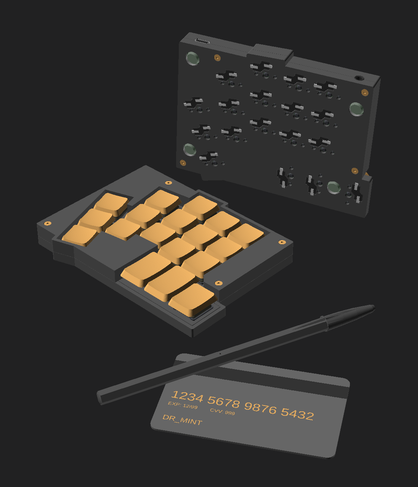
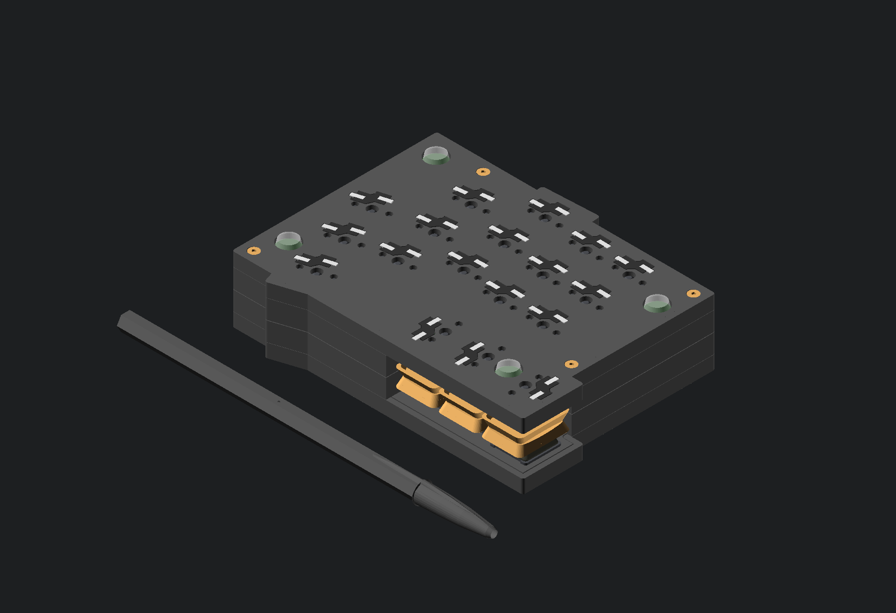
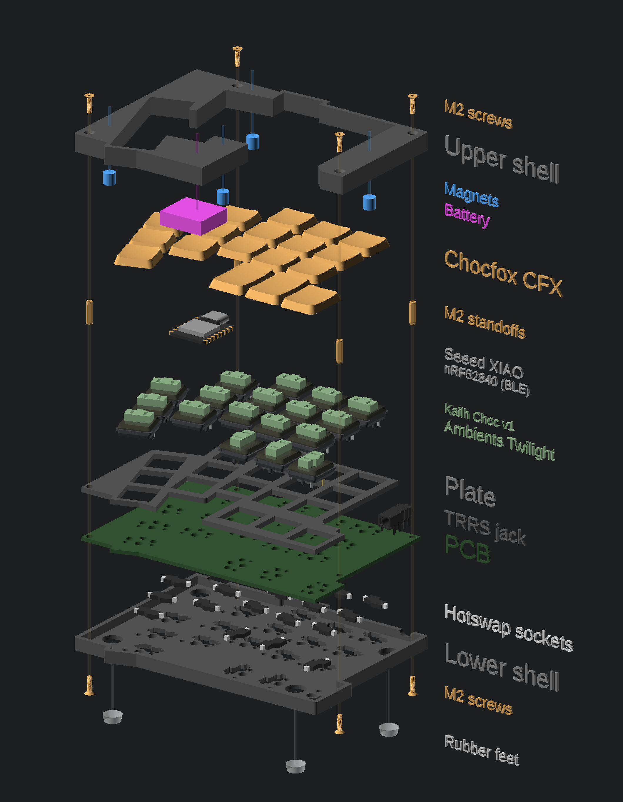

# Mint36tt (provisional name)

## Design goals

1. Ergonomic
    - Split
    - Reduced number of keys
    - Reduced key spacing
    - Splay
    
2. On-the-go
    - Low profile
    - Silent
    - Small footprint
    - key protection
    - Light
    - USB-C

3. Sourceable
    - Open source hardware
    - 3D printable (FDM)
    - Common components
    - Hot swappable board and switches
    - Reasonably cheap

## Switches

Kailh Choc switches are the thinnest at 11mm (ref. https://www.reddit.com/r/MechanicalKeyboards/comments/165c11v/the_biggest_issue_with_lowprofile_switches_they/).

There are thinner switches such as the Kailh Notebook X (6.5mm) or the Cherry MX Ultra low-profile (3.5mm). But these are more expensive and don't have much variety.

Choosen switches: **[Kailh Choc Ambient Silent](https://lowprokb.ca/products/ambients-silent-choc-switches)**

## Key caps

Chocs standard keycaps are 16.5mm × 17.5mm. I decided to go with 16.5mm × 16.5mm CBX keycaps from Chosfox, which results in a 17.5mm spacing (a ~15% area reduction compared to MX's 19mm spacing).

It's possible to buy [15mm keycaps](https://3dkeycap.com/products/choc-colored-keycap-set) for a 16mm spacing (~30% area reduction). That would be the smallest possible spacing when paired with Chocs as 15mm is already the size of the switches.

It's also possible to reduce the gap beween keys. The standard is 1mm, but it could possibly be reduced to 0.5mm if the switches have little to no wobble and the tolerances on other parts are top notch.

Choosen caps: **[CFX caps](https://chosfox.com/collections/choc-keycaps)**

## Microcontroller

Choosen microcontroller: **[Seeed Studio XIAO RP2040](https://www.seeedstudio.com/XIAO-RP2040-v1-0-p-5026.html)** or **[Seeed Studio XIAO nRF52840](https://www.seeedstudio.com/Seeed-XIAO-BLE-nRF52840-p-5201.html)** for wireless.

## Shopping list

### Common for either version
- Left and right PCBs
- 4 × 7 pin headers
- 36 × 1N4148W SOD123 diodes
- 36 × Chocfox CFX caps, including:
    - 30 × 1U Chocfox CFX caps
    - 2 × 1.25U Chocfox CFX caps
    - 4 × 1.5U Chocfox CFX caps
- 36 × Kailh Choc switches 
- 36 × Kailh Choc Hot Swap Sockets (recommended)
- 8 × Rubber feet (Ø 8mm × 3mm) (recommended)
- 1 × USB-C cable

### Specific for the wireless version
- 2 × Seeed Studio XIAO nRF52840
- 2 × 601818 LiPo 3.7V 170mAh (18mm × 20mm × 6mm)
- 2 × MSK12C02 on/off slide switch

### Specific for the wired version
- 2 × Seeed Studio XIAO RP2040
- 1 × TRRS cable
- 2 × TRRS jacks PCB mount (MJ-4PP-9 or PJ320A)

### With the case (recommended):
- Left and right upper cases
- Left and right lower cases
- 2 × reversible plates (optional)
- 8 × N52 neodymium magnet (cylinder-shaped, Ø 5mm × 5mm) (recommended)
- 16 × M2 countersunk screws (Ø 2mm × 6mm)
- 8 × M2 standoffs (Ø 2mm × 10-12mm)